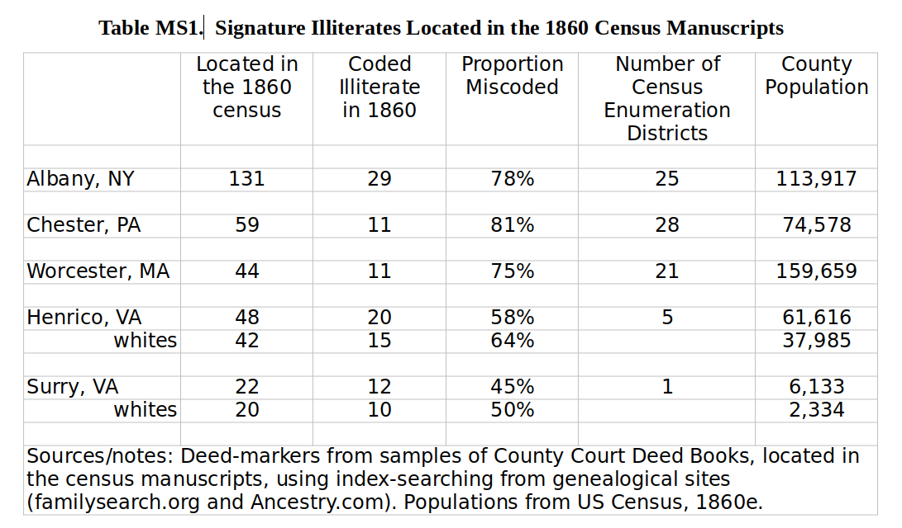
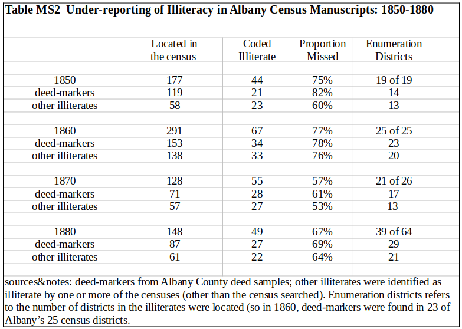
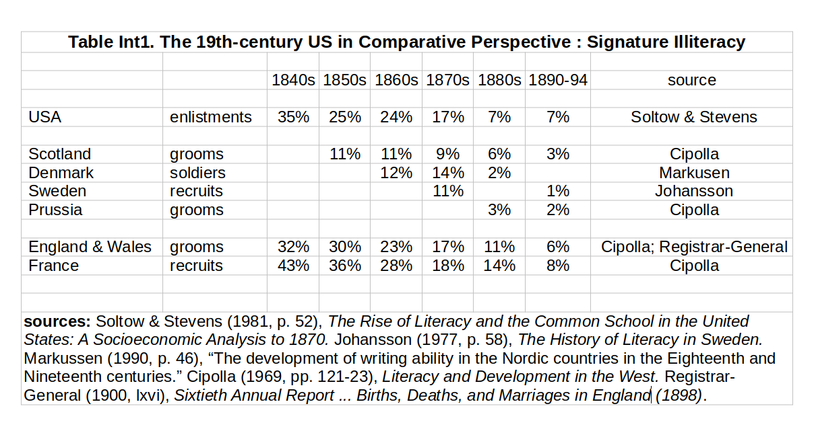
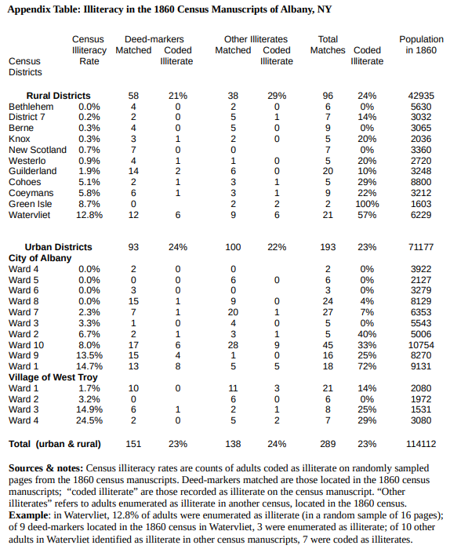

### Overview^[**Acknowledgements**: We are grateful to Stanley Engerman for important suggestions on early stages of this research. ]
This project is exploring two related hypotheses.

First, widely-reported high rates of literacy in the US in the second half of the nineteenth-century US are simply and substantially wrong. A half-century's scholarly consensus dramatically exagerates the extent of writing skills in the nineteenth-century US. Current characterizations of literacy in the US rely on decennial census data, which are supposed to reflect counts of illiterates (those unable to "read and write"). However, scrutiny of the census manuscripts, combined with direct evidence of illiteracy from county court records (deeds) reveals a staggering degree of non-reporting of illiteracy. A mounting assemblage of evidence points to the conclusion that the census-based estimates dramatically overstate the extent of basic writing skills among the population. Although reading skills might have been widespread, <!-- Hall and others widespread reading --> current views understate the proportions of American adults who could not even write their names (to say nothing of writing sentences to communicate). A substantial research effort will be required to pin down that proportion among relevant populations of mid-century America (populations in terms of nativity, region, servile status, and race).  

Second, familiar characterizations of the US as a world-leader in literacy in the 19th Century are mistaken, stemming from inconsistent comparisons. European literacy comparisons rely on signature data from large populations of young adults (grooms, brides, and military recruits). Comparing the European signature-based evidence to US census-based estimates gives the impression that the US was far ahead of any European nation in terms of approaching universal literacy (defined as basic reading and writing). However, attention to the small set of signature-data available for the US points to the conclusion that the mid-nineteenth-century US was well behind Europe’s literacy leaders (the Scandinavian countries, Germany, Scotland, and Switzerland), with national signature literacy rates comparable to those in England and France.
<br>
<br>

### 1. Introduction: The Illusion of Literacy in the Antebellum US

There is a broad scholarly consensus that literacy (reading and writing) was widespread in the US in the mid-nineteenth century, and that the US was the world-leader in achieving mass literacy.^[For the consensus on widespread literacy in the nineteenth-century US, and the US as world literacy leader, see Engerman and Sokoloff (2011, and earlier works), Goldin (2006),  Graff (1987), Easterlin (1981) and Cipolla (1969, pp. 72, 99). There is some confusion in Engerman and Sokoloff’s reporting of census-based literacy rates for the US, which could distract us from problems in the underlying census data. Engerman, Sokoloff, and Mariscal (2012, p. 135) report white adult literacy rates in 1850 of 94-95% for Massachusetts, New York, and Pennsylvania; those are consistent with illiteracy data in published census volumes. However, Engerman and Sokoloff report a white adult literacy of 96.9% for the US North as a whole in 1850 and 1860, in various other works published in the period 2000-2012, citing published US census sources. That 96.9% literacy rate (3.1% illiteracy rate) is not consistent with any published census data, which have adult illiteracy rates for northern whites of 6% in 1850 and 1860 (and much higher rates for southerners). Apparently the literacy rate of 96.9% was first published in Mariscal and Sokoloff (2000); it appears thereafter in Engerman and Sokoloff’s influential writings  (sometimes with co-authors) which culminated in their book (2011) *Economic Development in the Americas since 1500: Endowments and Institutions*. It bears emphasis however, that inconsistencies and errors in the reporting of US census evidence on illiteracy are largely irrelevant to the point developed below: the US census mansucripts dramatically under-reported illiteracy. Our current guess is that the US adult white illiteracy rate in 1860 was over 1/6.] Writing in the authoritative *Historical Statistics of the US*, Goldin (2006, Bc 2-387) sums up the prevailing view of the US at mid-century, describing literacy as "virtually universal ... among the free population" and identifying the US as "the best-educated country in the world".^[That view finds some support in the US censuses of 1850 and 1860, which suggest adult illiteracy rates for the free population of about one-tenth (Leigh 1870 p. 811), which might be described as mass literacy. Even allowing for 100% illiteracy among enslaved African-Americans (about 11% of US adults), the census data imply that the US was well ahead of Europe’s leaders in the nineteenth-century rise of mass literacy. Leigh assumes 100% illiteracy among slaves to estimate adult illiteracy rates for the US of 23% in 1850 and 20% in 1860.  At that time, Scotland was the European leader in writing-literacy, with about 17% of adults marrying unable to sign their name to the marriage register circa 1855 (Stephens 1999, p. 127; 1855 Scotland, grooms 11%  brides 23%  (average 17%)). Reasoning that older persons were substantially more illiterate than newlyweds, it is safe to infer that adult illiteracy among Scots in the 1850s far exceeded the levels seen in the US census data.]    

But with simple scrutiny of the evidence, it turns out the scholarly consensus on US literacy leadership is unfounded, resting on illusory evidence and inconsistent comparisons. The US census data that underpin the scholarly consensus on nineteenth-century American literacy is simply not credible: blank entries for illiteracy on manuscript schedules have been mistaken for evidence of literacy.^[To be fair, if the census manuscripts were accurate, then a blank entry would be evidence of literacy; for example, in 1860 the “Instructions to Enumerators” advised “If the person can read and write in a foreign or in our own language, the space is to be left blank” (Census Office, 1860, p. 18). However, our empirical work demonstrates that the census manuscripts are rife with incorrect blanks in the illiteracy space.] Starting in 1850, federal census-takers were instructed to identify illiterate adults --  those “unable to read and write” (in any language).^[The 1840 census also addressed illiteracy, with an entry for a count of illiterates in each household. But we largely ignore the 1840 census, because the population schedule recorded data on a household level, with only the household head named. We restrict our attention to the subsequent censuses, when the population manuscripts enumerated free people by name, providing us a basis for matching individuals across data sources (county court records and census manuscripts).] However, our research efforts reveal an extraordinary degree of non-reporting of illiteracy.  From county courts’ deed records, we identify signature-illiterates -- those who used a mark to sign their deed (as opposed to writing their name). Locating the signature illiterates in the census manuscripts, we find the illiteracy entries were blank for a huge majority. And cross-matching among census manuscripts from various years points to a more general pattern of non-reporting of illiteracy.  

As more evidence is collected, it will become obvious that literacy was far from universal in the mid-nineteenth-century US. Rather, as Folger and Nam (1967, p.11) pointed out over a half-century ago, "illiteracy was widespread."  Only if we ignored about one half of the adult population -- southerners (white and black) and the foreign-born -- could we describe Americans as a literate people in the middle and later nineteenth century.^[As in the US census, literacy refers to the ability to read and write. The extent of reading abilities among the US population has yet to be determined, and is not easily measured (whereas signatures versus marks are pretty simple). See e.g. Hall (1989) for the view that reading was near universal in colonial New England. FOLLOW-UP NEEDED: find sources for a summary statement on reading-literacy in the 19th-C US. Note that Cipolla (1969, e.g. p. 72) focuses on reading literacy, which makes his US-Europe comparisons problematic.] To find something like mass literacy in the nineteenth century, we need to turn to Europe's literacy leaders, including Germany, Scotland, Switzerland, and the Scandanavian nations. Those countries were the most literate of the later nineteenth-century world, based on direct evidence of basic writing skills among broad cross-sections of young adults, in the form of signatures versus marks in marriage records and military records.^[The ability to write one’s name is a simple but clear indicator of literacy, especially among the young. Among the elderly, frailty might be mistaken for illiteracy, so data from wills needs to be used cautiously.] Leaving aside the inflated census-based estimates of US literacy, we have only a limited empirical basis for ranking the US.  But Soltow and Stevens (1981) sampled US army enlistment records, and their results place the US into the second tier of nations, similar to England and France.  Characterizations of the US as a world-leader in nineteenth-century literacy are simple and erroneous extrapolations from the illusion of literacy in US census data. 


### 2. The Illusion of Literacy in the Antebellum US Censuse

Our research (2017) on “Women’s empowerment and economic growth: Albany, NY, 1760-1860” found unexpectedly high signature-illiteracy in Albany deed records from the 1850s. The federal census has illiteracy rates for white adults in the State of New York of some 5 to 6 percent in 1850 and 1860; but among Albany deed-grantors in the 1850s, over 8% were unable to sign their names, using a mark, rather than a signature, to endorse their deed. Of particular note, over 12% of the women signing deeds used a mark, compared to less than 5% if men, revealing a pronounced gender gap in literacy. We had expected deed-grantors to be above average in terms of literacy, based on considerations of social class, but we leave aside *a priori* analysis of the literacy of deed-makers versus adults in general. Instead, we move directly toward an improved empirical perspective.^[Based on class issues, we had expected deed-grantors to be substantially more literate than average.  But perhaps they were old and the literate were young.  Or perhaps Albany simply was a locale of relatively high illiteracy? As the eastern terminus of the Erie Canal, maybe Albany attracted a disparate group of hard knock stevedores and unlettered immigrants. However, based on 1860 census samples (IPUMS data), illiteracy in Albany looks quite typical of the state of New York, and of the Middle Atlantic States more generally.]   

Our first step toward clarifying illiteracy in mid-nineteenth-century Albany looked to the 1860 census manuscripts, locating deed-markers in order to characterize them in terms of potentially relevant dimensions such as age, nativity, race, occupation, and wealth-holding. However, early on in the census-matching process a simple and dramatic result emerged: the 1860 census manuscripts largely failed to enumerate deed-markers as illiterate. The manuscript census schedules of 1850 and 1860 had one column to record illiteracy, titled "Person over 20 y'rs of age who cannot read & write"; the column was to be marked for any adult who could not read and write (an illiterate). But for the most part, the column was left blank for the deed-markers -- people with a demonstrated inability to write (an illiterate, by the census definition). We don't know why the illiteracy coding tends to be absent, but for our purposes the more important question is the extent to which the census failed to measure illiteracy. Blank cells in the illiteracy columns of the manuscript census have been taken as evidence of literacy; but our research reveals many many cases where the blanks are false negatives responses to the question "was this person unable write?" The question that looms is the extent to which non-reporting of illiteracy has generated an illusion of literacy, distorting our knowledge of the nineteenth-century US.^[The manuscript schedules of 1870 and 1880 used two columns to enumerate illiteracy, titled "Cannot read" and "Cannot Write", which were to used for persons age 10 years and older. The shift to two types of illiteracy might be expected to reduce under-reporting; for example, we suspect some enumerators in 1850 or 1860 reported only reading-illiteracy. That said, our research so far indicates substantial under-reporting of writing-illiteracy in the 1870 and 1880 manuscripts.]

We pursued two tracks to uncover under-reporting of illiteracy in the decennial censuses. The first track starts with signature-illiterates identified from county court records (primarily, deed records, but also some marriage records from Virginia). The second track starts with individuals enumerated as illiterate in one or more census manuscripts. In either case, we start with individuals deemed to be illiterate. Then in a simple but painstaking process, using online genealogical indexes, we locate the deemed illiterates in census manuscripts, to check whether they were enumerated as illiterate. The results provide compelling evidence that the decennial census manuscripts are rife with blank cells which represent a failure to record illiteracy.^[As noted above, if a manuscript page was completed accurately, then the blank spaces for illiteracy would be evidence of literacy; the problem that emerges is that the manuscripts were generally not completed accurately, at least when it came to illiteracy.] We have a broad set of results for the 1860 census, which we focus on here.[See the appendices for our preliminary results for the censuses of 1850, 1870, and 1880 (the 1890 census manuscripts are not available). Given the similarity of census-based estimates of illiteracy across all of the post‑1840 censuses, it is not surprising to find under-reporting generally. However, we suspect that under-reporting tended to fall over time, and that actual illiteracy tended also to fall, resulting in a spurious appearance of low and stable illiteracy in the US across the second half of the 19th century.] Drawing on our research on land markets in the nineteenth-century US, we have samples of deed-markers from six sets of County Court records. In addition to Albany NY, we have samples from two other northeastern counties: Worcester MA and Chester PA. And we have samples from two counties in Virginia: Henrico (which included the City of Richmond), and Surry, both located in the Tidewater (eastern Virginia). Table MS1 reports our results (so far) from matching deed-markers to the manuscript census of 1860.

\
```{r pressure, echo=FALSE, out.width = '80%'}

```  

\    

Table MS1 reveals a dramatic degree of under-reporting of illiteracy. For example, for Albany NY we located 131 deed-markers in the 1860 census manuscripts, but only 29 of them were recorded as illiterate by the census enumerators, leaving 78% miscoded (illiteracy blank) and appearing as literate in the census. It is worth noting that the 131 deed-markers were spread out over 25 different Albany census enumeration districts, revealing a general failure to enumerate illiteracy, as opposed to a few idiosyncratic enumerators leaving illiteracy blank.
	 As Table MS1 reports, similar degrees of under-reporting of illiteracy are evident in Chester, PA and Worcester, MA, the two other northern locales for which we have carried out the matching exercise. In Chester, the illiteracy entry was miscoded (blank) for 48 of the 59 deed-markers we matched to the census; in Worcester, illiteracy was miscoded (blank) for 33 of the 44 entries that we matched. And in these counties, as in Albany, the under-recording of illiteracy was spread out over a large number of census enumeration districts – 28 for Worcester and 21 for Chester. Taken together, the three sets of results give us results for 216 signature-illiterates matched into 62 different census enumeration districts. Across those 62 districts, well over three-quarters of the signature-illiterates were mis-coded, with blank spaces where illiteracy should have been marked.

Table MS1 also presents results from two counties in Virginia, Henrico and Surry, both located in the state's long-settled Tidewater region. For Henrico, we have matched a sample of 48 deed-markers to the 1860 census, across 5 census enumeration districts. With 42% of the deed-markers correctly enumerated as illiterate, Henrico had less under-reporting than the three northern cases (58% miscoded versus 22%). However, in part, Henrico's advantage reflects a near-complete enumeration of illiteracy among the six African-American deed-markers in the sample, five of whom were correctly coded as illiterate in the census. If we restrict attention to whites, the proportion of illiterates correctly coded drops to 36% (15 of 42). A similar pattern is evident in our results from Surry County, where the free population was enumerated in a single district, by one J. L. Hargan. For Surry, we located 22 deed-markers in the 1860 census manuscripts, 12 of whom were correctly coded as illiterate. But two of the twelve were free people of color, and the proportion of whites correctly coded was just one-half (10/20). In sum, our results from 6 census enumeration districts in Virginia in 1860 feature somewhat less under-reporting of illiteracy than we found in the 62 northern districts.^[The antebellum South is well known for relatively high illiteracy within the US, so it is intriguing to find less under-reporting in this small set of southern districts, compared to our results for northern districts. One wonders whether some of the North’s apparent advantage in literacy reflects non-reporting of illiteracy; and one wonders there was less under-reporting in the South because illiteracy was less stigmatized in a society where it was more routine (common).] However, the key finding for our purposes is that once again, the 1860 census manuscripts substantially under-reported adult white illiteracy. The Virginia evidence provides additional support for our contention that mass literacy in mid-19th century America will be revealed to be an illusion.

If our results generalize, we could speculate that the 1860 census under-reported illiteracy by a factor about four, suggesting that the actual rate of adult white illiteracy for the US was about 36% (four times the rate from the census; Leigh (1870, p. 812)).^[Leigh's results (p. 811) include adult white illiteracy for the native-born white (7.6%) and the foreign-born (14.5%).] However, even looking past the relatively narrrow geographic scope of our results, there are good reasons to pause before extrapolating from our results. It would be a huge stretch to claim that the 1860 census’s under-reporting of illiteracy among deed-makers was representative of under-reporting among illiterates more generally. For example, perhaps stigma was an important factor in the under-reporting of illiteracy. One can imagine a census-taker discreetly overlooking occasional illiteracy among the "better sort" while dutifully recording the illiteracy of the less respectable (indigents, immigrants, people of color). But again, rather than chase down a priori possibilities to learn from our results, it makes more sense to work toward an improved empirical perspective.

A key question is whether illiteracy among deed-markers tended to be overlooked (not enumerated) to a greater extent than adult illiteracy in general adults. We identified various illiterates in Albany from the NY State censuses of 1855 and 1865, and from the US censuses of 1850 and 1870. We refer to these people as “other illiterates”, to distinguish them from the deed-markers. To the extent that we were able to locate the “other illiterates” in the 1860 manuscripts (using the online indexes), we could  determine whether their illiteracy was correctly coded in 1860. Table MS2 (below) includes a summary our results, and an appendix table breaks down the results by the 1860-census districts. We matched 138 “other illiterates” to the 1860 population manuscripts, and found 33 of them correctly coded as illiterate; that left 76% of them mis-coded, with blanks for illiteracy. That 76% proportion is virtually the same as the 78% of deed-markers who were mis-coded (blank illiteracy). In sum, we find the same high rates of under-reporting of illiteracy for the deed-markers and illiterates more generally. These results tend to rule out notions of differential stigma or class deference generating excessive under-reporting of illiteracy.


\
```{r press2, echo=FALSE, out.width = '75%'}

```  

\    

Finally, Table MS2 offers an extension of our analysis to the other three nineteenth-century federal censuses which also were supposed to enumerate illiteracy for individual adults (1850, 1870, 1880). In the course of locating illiterates (deed-markers or other) in the 1860 census, we often located them also in the other censuses. Gathering together our results in Table MS2, we find a strong general pattern that the federal population censuses substantially under-reported illiteracy in Albany NY.    
	
The 1850 census missed 75% of the illiterates we located, about the same high rate of non-reporting of illiteracy as we found in 1860 (77%). The 1870 census was the best of a bad lot in recording illiteracy; almost 40% of deed-markers were recognized as illiterate in the 1870 census, as were close to one-half of “other illiterates”, but overall,  57% of the 1870 illiterates were miscoded, with blank entries for illiteracy.  Perhaps surprisingly, the results for the 1880 census were a little worse than those for 1870, with two-thirds of the illiterates mis-enumerated with blanks for illiteracy. Taken together, the results point strongly to the conclusion that the high rates of literacy that have been extracted from the US census data are profoundly flawed.^[The results demonstrate that the federal censuses dramatically under-reported illiteracy in Albany NY in the second half of the nineteenth century. In terms of census-based illiteracy rates, Albany looks about typical of the northeastern US at the time. Although it could turn out that Albany happened to feature both high illiteracy rates and high rates of non-reporting, we expect to find instead that Albany’s illiteracy and reporting were about typical of the Northeast. Arguably, the case of Albany reveals the literacy illusion of 19th-century America.]

#### *Sketching next steps for identifying census undercounting of illiteracy*

**Albany, NY, in 1860** The [Appendix](#App) Table shows results from random sampling of pages in each of Albany’s 25 census enumeration districts in 1860. We find three types of enumeration: 13 districts with negligible enumeration of illiterates (sampled adult illiteracy rates < 2%); 5 districts with relatively high rates of illiteracy enumerated (>12%); and 7 districts with non-negligible rates of illiteracy enumerated (2-9%). Across all of Albany census districts, the sampled adult illiteracy rate was 5.9%; dropping the 13 districts with negligible illiteracy enumerated raises the sampled illiteracy rate to 9.9%. In view of the unreporting of illiteracy in those 13 districts, it seems likely the actual adult illiteracy rate in Albany in 1860 was on the order of one-quarter.^[Restricting attention to the 13 census districts with non-negligible enumeration of illiteracy, we matched a total of 139 illiterates to the census manuscripts, and only 38% were enumerated as illiterate. Taking the 38% recording rate as representative, implies a correction factor of about 2.6 (1/0.38), which if applied to the 9.9% sampled illiteracy rate results in a corrected adult illiteracy rate of 26%, or about one-quarter.]

**Identifying underenumeration of illiteracy in the 1860 full-count IPUMS  **
Using the IPUMS-USA complete count coding of the 1860 census, we will identify census districts in which illiteracy was demonstrably under-reported. A priori, we know of high-illiteracy populations of adults in 1860; examples include free persons of color, Irish immigrants, and French-Canadian immigrants. Census districts with sizeable populations of such high-illiteracy groups provide a basis for identifying non-reporting of illiteracy. For example, if we find a census district has 100 Irish-born adults, with none coded illiterate, we'll be confident the district's illiteracy data is not valid. Similarly, we may be able to identify districts in which illiteracy seems well-coded. Patterns in the data in such districts may permit us to infer illiteracy rates in the districts for which illiteracy was not reported.  
<br>
<br>

### US Signature Illiteracy in International Perspective 

The most useful credible national evidence on 19th-century US illiteracy comes from Soltow and Stevens' sample of the National Archives collection of enlistment records.^[See Soltow and Stevens (1981, p. 51) for some description of the sample. Stevens (1987, p. 101) suggests the enlistments data are “probably biased upward for illiteracy, since enlistees ... included a disproportionate share of those in lower socioeconomic groups.” Similar biases would be expected in the European data, so we ignore them for the rough comparisons we offer here.] Soltow and Stevens' sample provides a basis for at least a rough comparison to European cases, for which we have evidence on the writing ability of two sets of young men -- bridegrooms and recruits (or in Denmark, soldiers more generally). Of interest here are the rough magnitudes, and we find that the US fits with the second tier of European countries in terms of illiteracy (writing skills). 

\
```{r pressure0, echo=FALSE, out.width = '80%'}

```  
\

Viewing the signature illiteracy rates in Table INT1 as nationally representative of the (writing) illiteracy of young men, we see the US falling short of the European leaders in literacy -- Scotland, Denmark, and Sweden -- but somewhat ahead of England and France.  Across the second half of the 19th century, the proportion of US enlistees unable to sign their name was substantially greater than the proportions of Scottish grooms and recruits in Denmark or Sweden (for example, in the 1850s and 1860s, one-quarter of US enlistees signed by mark, compared to about one-tenth of Scottish grooms or Danish soldiers). At mid-century, the US appears to be somewhat ahead of France or England (with signing by mark rates of 36% in France and 30% in England, compared to 25% in the US), but that advantage could simply reflect the absence of African Americans from the US army enlistments, rather than a greater writing ability among American men on the whole.^[To illustrate the magnitude of the bias, if African-Americans were 90% illiterate and 12% of population, then the table’s 1850s 25% illiteracy rate would rise to 33%, about on par with the values for England and France.] After the Civil War, the US army included African Americans, so that bias was gone.^[From 1870-1898 African Americans were about 10% of the US arrmy; Coffman (1968, pp. 365, 482), *The Old Army: A Portrait of the American Army in Peacetime, 1784-1898*.] It would be a mistake to put too much weight on Soltow and Stevens' national-level signature-illiteracy data to the trace out the evolution of literacy across the 19th century, but the data challenge characterizations of the US as the 19th century’s leading nation in the rise of mass literacy. 

*Next steps* ... When the National Archives in Washington DC reopen, we will draw samples from the 19th-century enlistments records there. The goal is to assemble samples that will allow us to characterize patterns of signature-illiteracy among US army recruits, with attention to geographic, geographic, and temporal variations; and in relation to ethnicity and national origin.
<br>
<br>
<br>

---


<a name="App"></a>


### Appendix


\
```{r press4, echo=FALSE, out.width = '80%'}

```  
\
